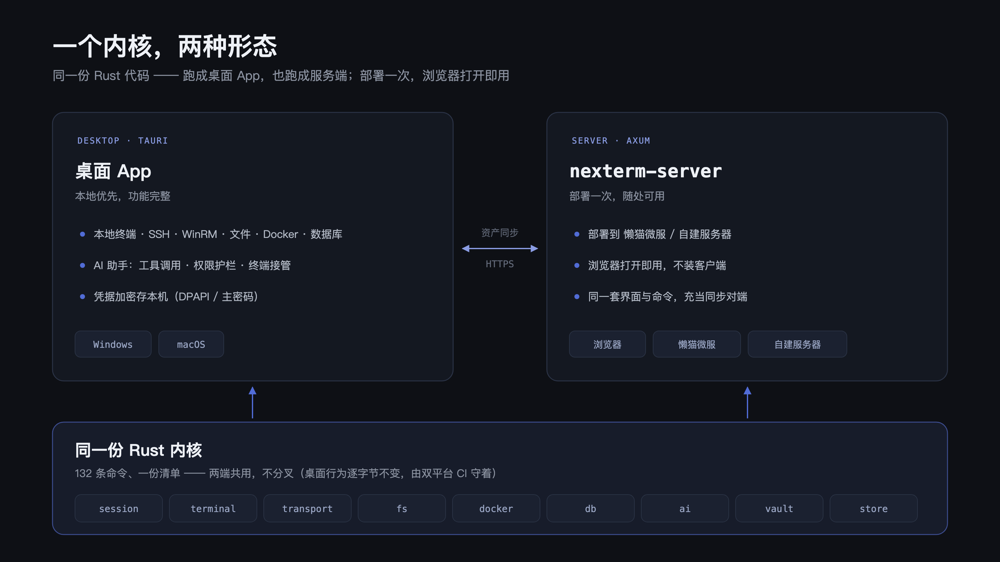
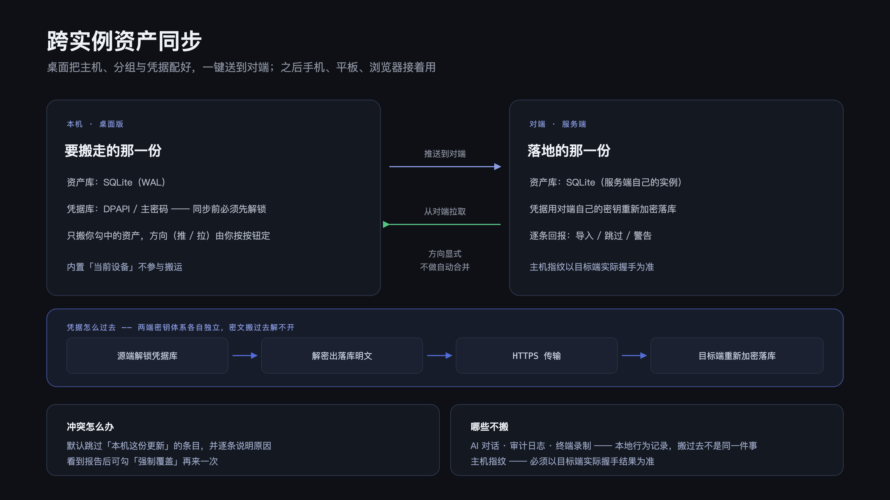
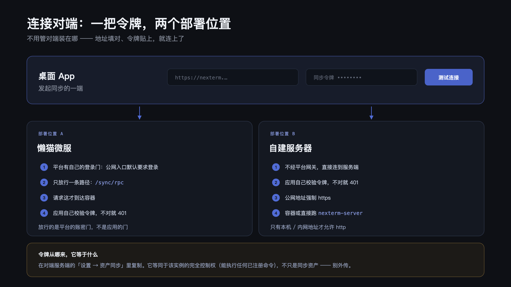

<div align="center">


# NexTerm

**一体化开发运维终端 —— SSH · WinRM · 文件 · Docker · 数据库 · AI，装进同一个窗口**

桌面 App 与浏览器版共用同一份 Rust 内核。凭据加密存储，AI 全程在权限护栏内执行。

[](https://probiusofficial.github.io/NexTerm/)


</div>

---


运维工具链历来分散：SSH 客户端、SFTP 工具、Docker 面板、数据库客户端各占一个窗口，AI 助手还要切出去粘贴报错。NexTerm 将它们收进同一个三层工作区——工作区、分屏面板、标签，并为 AI 提供一条**看得见、管得住**的执行通道：每条命令、每次文件修改实时可见，危险操作先经确认。

同一份内核现在有**两种跑法**：装在自己电脑上的桌面 App，和部署到服务器、浏览器直接打开的服务端。两者之间用**资产同步**打通——桌面上配好的主机与凭据，一键送到对端。

## 一个内核，两种形态



| | 桌面 App | 服务端 `nexterm-server` |
|---|---|---|
| 装在哪 | 本机（Windows / macOS） | 服务器或容器，浏览器访问 |
| 内核 | 进程内嵌同一份 | 进程内嵌同一份 |
| 凭据落点 | 本机（DPAPI / 主密码） | 服务端实例（平台注入的主密钥） |
| 适合 | 日常主力工作台 | 换设备接着用、多端访问 |
| 同步角色 | 发起方 | 被同步的对端 |

两端**共用同一份命令清单**（132 条），行为一致。「桌面行为逐字节不变」不是口头承诺，而是由双平台 CI 把关的。

服务端版本不装客户端，浏览器打开即用；手机平板受限于没有 Ctrl 键与右键菜单，终端体验有限，已在包元数据里显式声明不支持的平台，而不是让用户装上一个用不了的应用。

## 跨实例资产同步



桌面版和服务端是**两个独立实例**，各持一份 SQLite。没有同步，用户就得两边各配一遍，改了一边另一边立刻变旧。同步搬运的范围是**资产 + 分组 + 凭据**。

- **方向显式** —— 勾中资产，按「推送到对端」或「从对端拉取」。内核只提供 `export` / `apply` 两个原语，不猜方向：SSH 私钥这类载荷根本不可合并，与其做个半吊子的自动合并让人不敢用，不如把选择交给你。
- **默认不覆盖更新的那一份** —— `apply` 会跳过「本机这份更新」的条目并逐条说明原因。同步最常见的误操作是「拿一台旧机器的包盖掉新改动」；而「跳过了什么」是能看懂、能补救的（看报告 → 勾强制覆盖 → 重来）。
- **凭据明文过河，落地重封** —— 两端密钥体系各自独立（桌面是 DPAPI / 主密码，服务端是注入的根密钥），密文搬过去解不开。所以是「源端解密 → HTTPS 传输 → 目标端用自己的密钥重新加密」。源端凭据库没解锁会**明确报错**，不静默跳过——静默的后果是「资产过去了、密码没过去」，等你在另一端点连接才发现。
- **公网强制 HTTPS** —— 只有本机与私有网段地址才放行明文 HTTP。访问令牌走明文等于交给同链路上的任何人。
- **不搬的东西各有理由** —— AI 对话 / 审计日志 / 终端录制是本地行为记录，搬过去不是「同一件事」；主机指纹必须以目标端实际握手结果为准（接受远端指纹等于关掉 TOFU 保护）。

### 连接对端：一把令牌，两个部署位置



填「对端地址 + 同步令牌」就能连上，**不用管对端装在哪**：

- **懒猫微服** —— 平台的公网入口默认要求登录，应用只把同步入口这一条路径从登录门里放行，请求这才到达容器，由应用自己校验令牌。
- **自建服务器** —— 不经平台网关，直接连到服务端，同样由应用自己校验令牌。

两种位置的令牌是**同一个机制**（对端服务端自己生成的那一串），部署位置只影响界面提示，不影响协议。

> ⚠️ 这个令牌等同于该实例的**完全控制权**——它调的是同一张 RPC 表，能执行任何已注册命令，不只是同步资产。别外传。

## 功能总览

| 模块 | 能力 |
|---|---|
| 终端 | SSH 真 PTY、本地 ConPTY、WinRM；多标签与分屏、搜索、会话录制，支持 UTF-8 / GBK / GB18030 / Big5 编码切换 |
| 会话 | 一台资产一条连接复用，关标签不断连；SSH / WinRM 指数退避自动重连（本机会话没有"重连"这件事，不会假装在重连） |
| 资产 | 内置「当前设备」本地资产 —— 装好即有一台机器（本机终端 / 文件树 / 容器面板都落在它上面），不可删除、可改名、可配默认 Shell 与起始目录；另有 SSH / WinRM / Docker / MySQL / Redis 资产，支持分组、搜索、拖拽归类 |
| 文件 | SFTP 浏览与虚拟滚动、带进度与断点续传的传输；内置编辑器支持查找替换、LF/CRLF 转换与编码切换；MD5 / SHA256 校验 |
| 挂载 | Windows `net use` 映射盘、Linux sshfs（本机文件直接看文件树，不需要挂载） |
| Docker | 容器列表、日志 follow、容器终端、启停删、镜像管理、容器文件浏览、批量操作；SSH 主机与本机都可用 |
| 数据库 | MySQL 库表浏览与 SQL 工作台；Redis SCAN 分页、类型感知查看与命令台 |
| 端口转发 | SSH 本地转发，复用已有会话打通内网数据库 |
| AI 助手 | OpenAI 兼容多模型、工具调用、权限护栏、终端接管、文件变更 diff、计划模式、上下文用量与缓存命中统计 |
| 凭据库 | 两级密钥信封加密、集中管理面板、引用关系与删除保护、日志自动脱敏 |
| 服务端 | 同一套界面在浏览器里跑，部署到服务器或容器；无桌面依赖 |
| 资产同步 | 桌面 ↔ 服务端双向搬运资产、分组与凭据，方向显式、冲突可审 |

## AI 助手

AI 不是贴在旁边的聊天框，而是接进了内核。

- **工具调用透明** —— AI 执行的每条命令以卡片进入对话流，展开可见完整输出与退出码；命令运行在独立执行通道，不伪装成向终端打字。
- **权限护栏** —— 操作按风险分级：安全操作直接执行；敏感操作弹确认卡片，可对本会话放行同类；格式化、批量删除等危险命令一律拒绝。只读、读写、静默三档模式随时切换。


- **文件变更可审** —— `write_file` / `edit_file` 在**确认卡片上先给出逐行 diff**（新建文件整份标为新增），执行后再落一张「变更记录」卡片。改动一目了然，而且是**批准之前**就一目了然。


- **终端接管 · 实验性** —— 基于内核侧终端状态机读屏、判定空闲、发送按键；按任意键立即夺回，全程显示接管横幅。
- **多模型与成本可见** —— 任意 OpenAI 兼容端点，两步连接测试；上下文用量环与缓存命中率常驻侧栏底部。


## 工作区

三层结构：工作区对应一台机器或一个连接，其下分屏，屏内开标签。标签始终挂载，切换不重连、不丢终端状态；分屏比例持久化，为一边敲命令、一边看日志的场景而设计。


连接资产后左栏切换为文件树，双击进入内置编辑器；命令面板提供宽幅文件浏览器。


## 下载安装

到 [Releases](https://github.com/ProbiusOfficial/NexTerm/releases/latest) 下载：

| 平台 | 文件 |
|---|---|
| Windows 10/11 x64 | `NexTerm_x.y.z_x64-setup.exe`（NSIS 安装器，双击即装） |
| macOS（Apple Silicon） | `NexTerm_x.y.z_aarch64.dmg`（拖入「应用程序」） |

### macOS 首次打开被拦下怎么办

安装包是 **ad-hoc 签名、未公证**的（没有 Apple Developer 证书），所以首次打开会被 Gatekeeper 拦一次。
这是预期行为，不是文件损坏：

1. 双击应用，看到「无法验证开发者 / 无法检查是否包含恶意软件」的提示 → 点**完成**
2. 打开 **系统设置 → 隐私与安全性**，下拉到「安全性」，点 **「仍要打开」**
3. 之后正常双击即可

若提示的是**「已损坏，无法打开」**（而不是"无法验证开发者"），那是签名问题，用命令行一次修掉：

```bash
xattr -dr com.apple.quarantine /Applications/NexTerm.app
```

> 只有 Intel Mac？目前只发 Apple Silicon 包，可用 Rosetta 或从源码构建
> （`pnpm tauri build --target x86_64-apple-darwin`）。

## 部署服务端

服务端适合放在**常开的机器**上：换一台设备，浏览器打开接着用；它同时是桌面版资产同步的对端。

### 懒猫微服

本仓库自带 LPK v2 打包与提审链路（`lazycat/` 与 `scripts/`），产物为应用商店可用的安装包：

```bash
lzc-cli project build      # 产出 cloud.lazycat.app.nexterm-v<版本>.lpk
lzc-cli project deploy     # 部署到自己的微服
```

微服的公网入口默认要求登录，应用在 `public_path` 里只放行了同步入口一条路径，
靠应用自己的令牌把关 —— 用浏览器打开应用，体验不变。

### 自建服务器（容器 / VPS）

```bash
cargo build --release --no-default-features --features server --bin nexterm-server
```

启动前把前端产物放到它找得到的位置（默认 `/app/dist`），再用环境变量配置：

| 环境变量 | 默认 | 说明 |
|---|---|---|
| `NEXTERM_LISTEN` | `0.0.0.0:8080` | 监听地址 |
| `NEXTERM_DATA_DIR` | 有 `/lzcapp/var` 用它，否则 `./data` | SQLite 与日志落点 |
| `NEXTERM_WEB_ROOT` | `/app/dist` | 前端静态资源目录 |
| `NEXTERM_MASTER_KEY` | 无 | 凭据库根密钥（≥ 8 位）。**不注入则凭据库保持未初始化**，SSH 密码类资产不可用 |

> 公开部署请自行评估：服务端是**常开解锁**状态，凭据库随进程可用。
> 别把它裸奔在公网上 —— 至少加一层反代与 TLS。

## 快速开始（从源码）

支持 Windows 与 macOS，从源码构建：

```bash
# 依赖：Rust stable（≥1.98）、Node 22+、pnpm 11+
#   Windows：MSVC 工具链；macOS：Xcode Command Line Tools
git clone https://github.com/ProbiusOfficial/NexTerm.git
cd NexTerm
pnpm install
pnpm tauri dev      # 开发窗口
pnpm tauri build    # Windows 出 NSIS 安装器；macOS 出 .app + .dmg
```

双平台 CI（Windows + macOS 各跑 fmt / clippy / test / typecheck / lint）在每次 push 时把关；
打 `v*` tag 由 `release.yml` 自动出两个平台的安装包并挂到 Release。

### 浏览器演示

免编译 Rust 预览全部界面，在线演示直接访问 [probiusofficial.github.io/NexTerm/demo](https://probiusofficial.github.io/NexTerm/demo/)。
前后端仅 `src/ipc/commands.ts` 的 `call()` 一个接口，纯浏览器运行或 URL 带 `?demo=1` 时自动切换内存 mock：

```bash
pnpm dev            # http://localhost:1420/
```

演示包含一台回显虚拟 shell，支持 `ls`、`cat`、`systemctl`、`docker ps` 与 Tab 补全、历史记录；另有 8 台资产、MySQL / Redis 面板、文件树与编辑器、AI 流式对话与确认卡片，命令块、搜索、录制全部可用。mock 为独立 chunk，生产包不加载；URL 加 `?demo=0` 回到真实后端。

## 架构

前端只有一份，运行环境三态：桌面（Tauri 容器）、服务端（浏览器 + 真后端）、演示（纯前端假数据）。三态靠同步读取的标记判定，不需要探测后端。

```
┌──────── WebView（React 19 + xterm.js）────────┐   ┌──── 浏览器 ────┐
│  资产树 · 标签/分屏 · 终端 · 文件 · DB · AI    │   │  同一份前端产物 │
└──────────────────── Tauri IPC ────────────────┘   └── HTTP / WS ───┘
                                                              │
        ┌──────────────── Rust 内核（Tokio）────────────────┐  │
        │ session/ 会话池·重连   terminal/ PTY+vt100 状态机   │  │
        │ transport/ ssh·winrm·local·forward   fs/ 传输·挂载  │◄─┘
        │ docker/ CLI 通道   db/ mysql·redis   ai/ agent·护栏 │
        │ vault/ 两级密钥加密  store/ SQLite(WAL)  sync/ 同步 │
        └────────────────────────────────────────────────────┘
                    ▲ 内嵌同一份（桌面）   ▲ 内嵌同一份（服务端 axum）
```

命令层是**一份** `macro_rules! nexterm_commands`，桌面侧喂给 Tauri 的 `generate_handler!`，服务端侧喂给一个 `Vec<Entry>`；平台差异靠 `ipc_shim` 收束，所以 132 条 `#[tauri::command]` 一行都不用改。

关键设计：

- **终端字节流不走 JSON** —— PTY 输出经 `Channel<Vec<u8>>` 直送 xterm.js，输入走 invoke。服务端模式同理走二进制 WebSocket。
- **内核侧终端状态机** —— PTY 字节流同步喂给内核 `vt100::Parser`，是 AI 读屏、空闲判定与终端接管的唯一数据源。
- **端到端背压** —— 本地 PTY 以阻塞线程加有界通道桥接；4MB 暂停、节流事件、隐藏标签批量刷新。
- **凭据两级密钥** —— 主密码经 Argon2id 派生 KEK，信封加密 DEK；凭据以 XChaCha20-Poly1305 加密；支持 Windows DPAPI 免主密码模式；日志统一脱敏。
- **AI 护栏独立成层** —— 风险分级与放行决策单一入口，不散落在调用点。

## 质量门

```bash
cargo fmt --all --check
cargo clippy --all-targets --all-features -- -D warnings
cargo test --workspace
pnpm typecheck && pnpm lint
```

`docs/diagrams/*.svg` 是本仓库架构图的源文件，用 `node scripts/render-diagrams.mjs` 渲染成 `docs/images/*.png`。

## Roadmap

独立同步核心（可脱离桌面单独部署的密钥中转）在设计中；其他系统正在构建中。

## 致谢

终端模拟基于 [xterm.js](https://github.com/xtermjs/xterm.js)，SSH 基于 [russh](https://github.com/Eugeny/russh)，桌面框架为 [Tauri](https://tauri.app)。

## License

[MIT](LICENSE)
