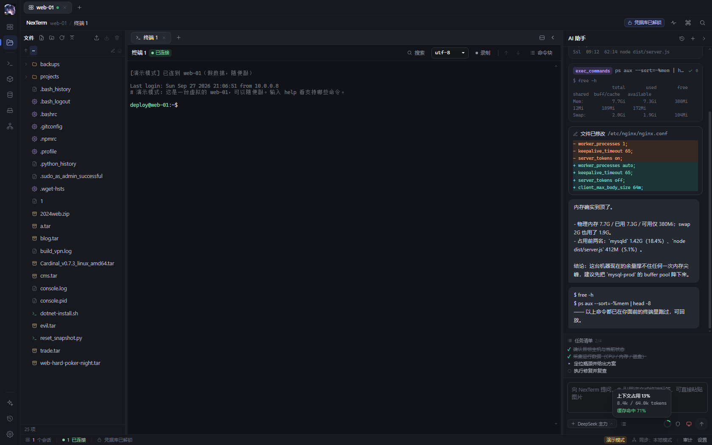
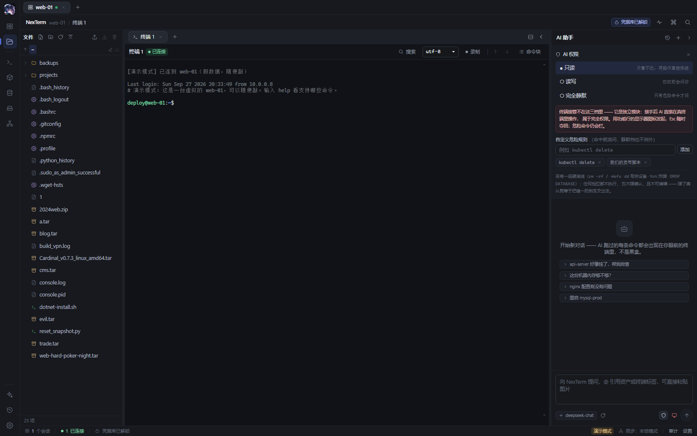
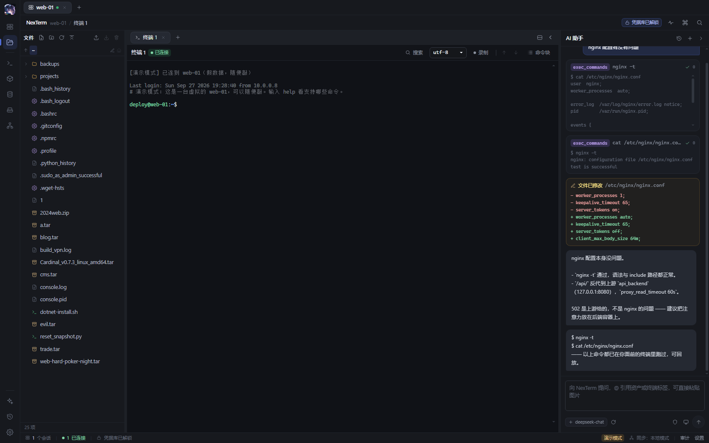
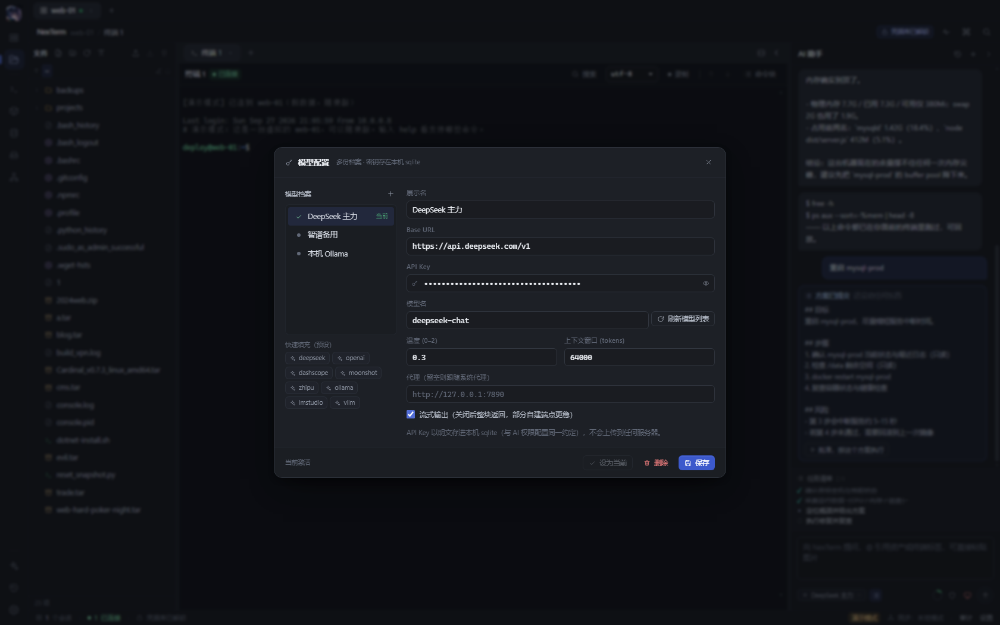
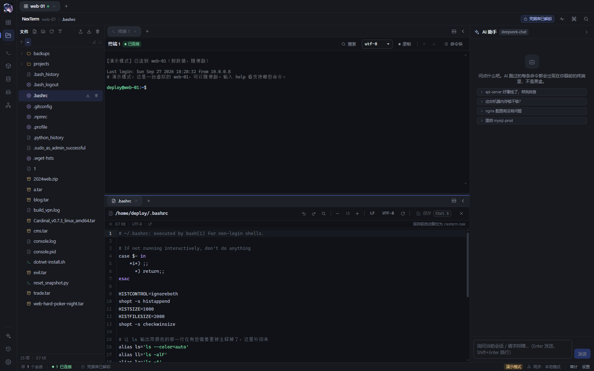
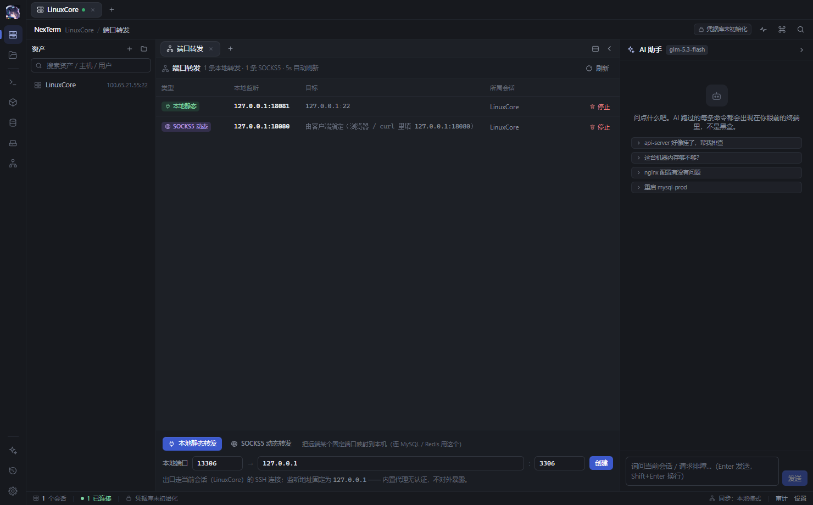

<div align="center">


# NexTerm

**一体化开发运维终端 —— SSH · WinRM · 文件 · Docker · 数据库 · AI，装进同一个窗口**

一个轻量的、AI 原生的桌面终端工作台。本地优先，凭据加密存储，AI 全程在护栏内干活。


</div>

---



做运维的时候，窗口永远不够用：SSH 客户端一个、SFTP 工具一个、Docker 一个、数据库客户端一个，
AI 助手还得再切出去复制粘贴报错。NexTerm 把这些放进同一个三层结构的工作区
（工作区 → 分屏面板 → 标签），并给 AI 一条**看得见、管得住**的执行通道——
它的每一条命令、每一次文件修改都实时呈现在你面前，危险操作先问你。

## 功能总览

| 模块 | 能力 |
|---|---|
| 终端 | SSH 真 PTY、本地 ConPTY、WinRM；多标签与分屏、搜索、会话录制、编码切换（UTF-8 / GBK / GB18030 / Big5） |
| 会话 | 一台资产一条连接复用，关标签不断连；指数退避自动重连 |
| 文件 | SFTP 浏览与虚拟滚动、上传 / 下载（进度 + 断点续传）、内置编辑器（查找替换、LF/CRLF、编码切换）、MD5 / SHA256 |
| 挂载 | Windows `net use` 映射盘 / Linux sshfs |
| Docker | 容器列表、日志 follow、容器终端、启停删、镜像管理、容器文件浏览 |
| 数据库 | MySQL（库表浏览 + SQL 工作台）、Redis（SCAN 分页 + 类型感知查看 + 命令台） |
| 端口转发 | SSH 本地转发，复用已有会话打通内网数据库 |
| AI 助手 | OpenAI 兼容多模型、工具调用、权限护栏、终端接管、文件变更 diff、计划模式、上下文用量与缓存命中统计 |
| 凭据库 | 两级密钥信封加密，日志自动脱敏 |

## AI 助手

AI 不是聊天框贴在旁边，而是接进了内核：

- **工具调用透明化** —— AI 执行的每条命令以卡片形式出现在对话流里，可展开看完整输出与退出码；
  命令真实地跑在独立执行通道，不假装"打字进终端"。
- **权限护栏** —— 操作按风险分级：安全操作直接执行，敏感操作弹确认卡片（可选"本会话允许此类"），
  危险命令（格式化、批量删除等）一律拒绝。三档权限模式（只读 / 读写 / 静默）由你切换。



- **文件变更可审** —— AI 的每次写文件都生成修改前后 diff，改动一目了然。



- **终端接管（实验性）** —— AI 借助内核侧的终端状态机读屏、判定空闲、发送按键；
  你按任意键立即夺回终端，全程有醒目接管横幅。
- **多模型与成本可见** —— 任意 OpenAI 兼容端点，连接性两步测试；上下文用量环与缓存命中率常驻侧栏底部。



## 界面

三层结构：工作区（一台机器 / 一个连接）→ 分屏面板 → 标签。
所有标签保持挂载，切换不重连、不丢终端状态；分屏比例记住，专为"一边敲命令、一边看日志"设计。



连接资产后左栏自动切换到文件树，双击直接进内置编辑器；命令面板提供宽幅文件浏览器。



## 快速开始

从源码构建（当前目标平台 Windows）：

```bash
# 依赖：Rust stable (MSVC) + Node 22+ + pnpm 9+
git clone https://github.com/ProbiusOfficial/NexTerm.git
cd NexTerm
pnpm install
pnpm tauri dev      # 开发窗口
pnpm tauri build    # 打包（NSIS 安装器）
```

### 浏览器演示模式

不想编译 Rust 也能看全部界面。前后端接口只有一处（`src/ipc/commands.ts` 的 `call()`），
纯浏览器运行或 URL 带 `?demo=1` 时自动切换到内存 mock 实现：

```bash
pnpm dev            # 打开 http://localhost:1420/
```

演示模式包含一台会回显的虚拟 shell（`ls / cat / systemctl / docker ps …`，
Tab 补全与历史可用）、8 台资产、MySQL / Redis 面板、文件树与编辑器、
AI 流式对话与确认卡片——命令块、搜索、录制全部真的能点。mock 数据是独立 chunk，
生产包不会加载。URL 加 `?demo=0` 回到真实后端。

## 架构

```
┌──────────── WebView2（前端 React 19 + xterm.js WebGL）────────────┐
│  资产树 · 标签/分屏 · 终端 · 文件 · Docker · DB · AI 侧栏           │
└──────────────────────── Tauri IPC ────────────────────────────────┘
          结构化事件(events.rs) + 二进制通道(Channel<Vec<u8>>)
┌──────────────────────── Rust 内核（Tokio）────────────────────────┐
│ session/ 会话池·重连    terminal/ PTY+vt100状态机+环形缓冲+背压     │
│ transport/ ssh·winrm·local·forward    fs/ 传输·挂载                │
│ docker/ CLI通道         db/ mysql·redis       ai/ agent·guard·    │
│ vault/ 两级密钥加密      store/ SQLite(WAL)    provider·takeover   │
└────────────────────────────────────────────────────────────────────┘
```

几条关键设计：

- **终端字节流不走 JSON** —— PTY 输出经 `Channel<Vec<u8>>` 直送 xterm.js，输入走 invoke。
- **内核侧终端状态机** —— 每条 PTY 字节流同时喂给内核 `vt100::Parser`，这是 AI 读屏、
  空闲判定与终端接管的唯一数据源。
- **异步运行时不阻塞** —— 本地 PTY 读取走"阻塞线程 + 有界通道"桥接，端到端背压
  （4MB 暂停 + 节流事件 + 隐藏标签批量刷新）。
- **凭据两级密钥** —— 主密码经 Argon2id 派生 KEK，信封加密 DEK；凭据用 XChaCha20-Poly1305；
  另有 Windows DPAPI 免主密码模式；日志统一脱敏。
- **AI 护栏独立成层** —— 风险分级与放行决策分离，唯一入口，不散落在调用点。

## 质量门

```bash
cargo fmt --all --check
cargo clippy --all-targets --all-features -- -D warnings
cargo test --workspace
pnpm typecheck && pnpm lint
```

## Roadmap

已在计划中：会话同步、PostgreSQL / MongoDB、RDP / VNC、命令广播、跳板机、macOS / Linux 构建。
v1 明确不做以上内容之外的功能扩张。

## 致谢

终端模拟基于 [xterm.js](https://github.com/xtermjs/xterm.js)，
SSH 基于 [russh](https://github.com/warpy-rs/rust-ssh)，桌面框架为 [Tauri](https://tauri.app)。

## License

<!-- TODO: 选定许可证后补充（建议 MIT 或 Apache-2.0），并在仓库根放 LICENSE 文件 -->
