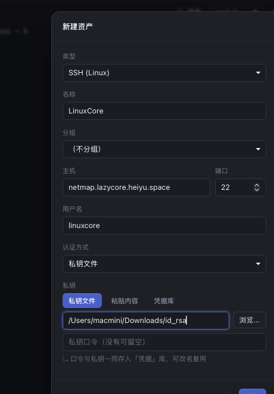
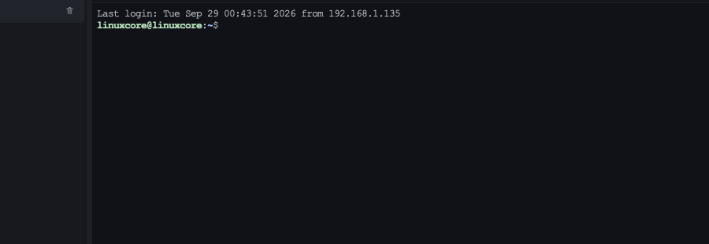
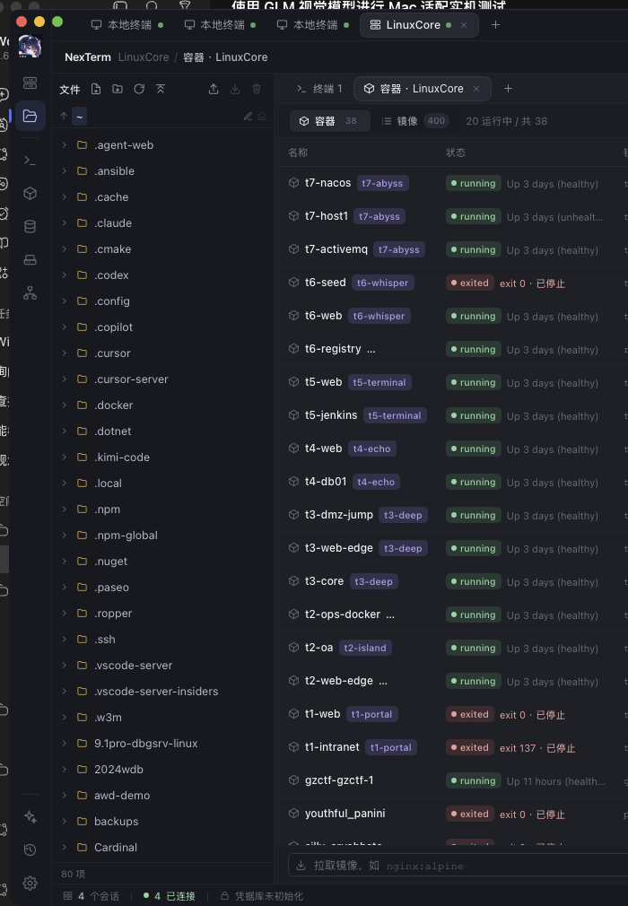
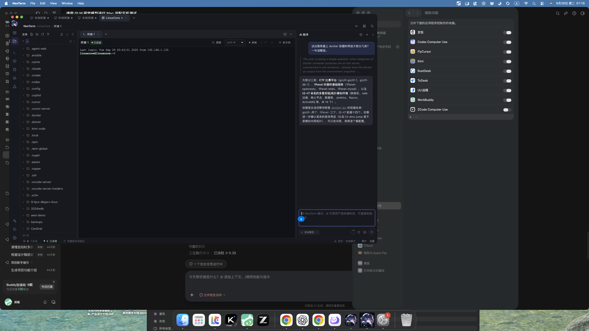
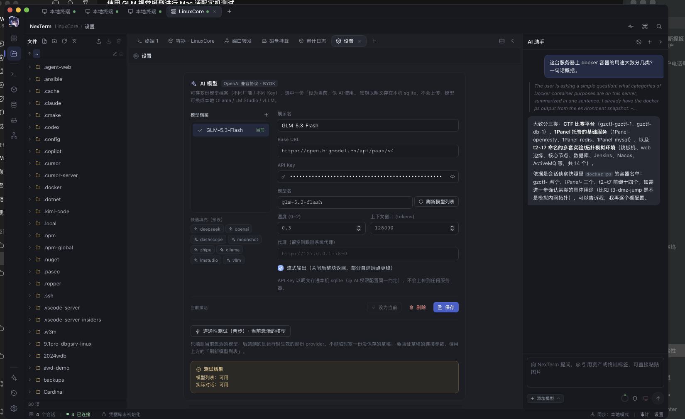
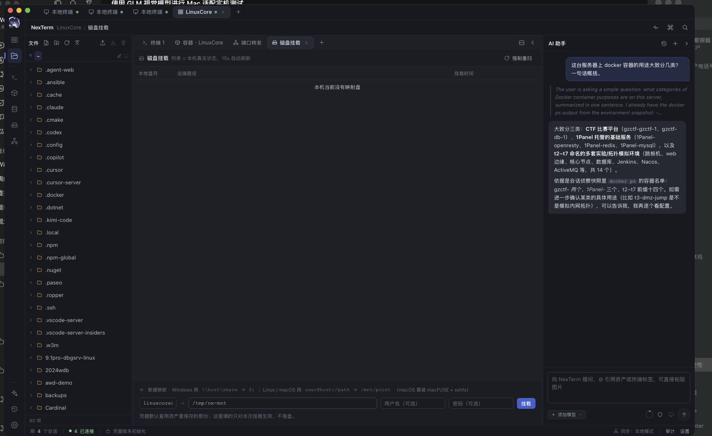

# NexTerm macOS 适配 · GUI 实机联测记录（第二轮）

> 日期：2026-09-29 · 承接 `ACCEPTANCE-macos-2026-09-29.md`（第一轮：质量门 + 内核侧真机测试）
> 本轮目标：把第一轮 §四「未验证项（需人工点击）」**全部改为 AI 自动驱动**并取真证据
> 本机：macOS，屏 2560×1440 · 靶机 LinuxCore `netmap.lazycore.heiyu.space` · 模型 GLM `glm-5.3-flash`

## 〇、结论速览

| # | 项 | 结果 | 关键证据 |
|---|---|---|---|
| 1 | 辅助功能授权 → AI 可驱动 GUI | ✅ | `AXIsProcessTrusted = true`；responsibility = `WorkBuddy.app/Contents/MacOS/Electron` |
| 2 | 新建资产（SSH + 私钥认证） | ✅ | 表单落库 `asset`；库中 `apiKey/model/baseUrl` 全部正确 |
| 3 | **主机指纹独立核验** | ✅ 一致 | 弹窗 `SHA256:fuhj2W9R9AKPJI/Zsz/26tD66tL98b7v7p81Jm/N4LI` == `ssh-keyscan` 实抓 |
| 4 | SSH 连接（真 PTY） | ✅ | 终端渲染 `Last login: … from 192.168.1.135` + `linuxcore@linuxcore:~$`；服务器侧同时存在 `sshd: linuxcore@pts/1` |
| 5 | 文件树（SFTP 列远程 home） | ✅ | 列出 `.bashrc/.bash_history/PHPSerialize-labs/upload-labs/…`，与 SSH 直连 `ls -a ~` 一致 |
| 6 | 容器面板 | ✅ | `容器 38 / 镜像 400 / 20 运行中`；名称 `t7-nacos`…`gzctf-gzctf-1` 全真实；**但镜像数错**（见发现 P0） |
| 7 | 端口转发 | ✅ 端到端 | App 进程 `47390` LISTEN `127.0.0.1:13306`；本机探测拿到真实 MySQL `8.4.2` / `caching_sha2_password` 握手包 |
| 8 | 磁盘挂载（macOS 分支） | ⚠️ 依赖缺失 | 本机无 macFUSE/sshfs；失败提示渲染为 `[object Object]`（见发现 P1） |
| 9 | 审计日志 | ✅ | 4 条 `connect`，含 `{"asset":"LinuxCore","kind":"ssh"}` |
| 10 | AI 对话（真实 GLM） | ✅ | 提问 → `reasoning_content` 独立思考流 → 中文回答；引用侦察快照中的真实容器名 |
| 11 | 内置两步连通性测试 | ✅ | `模型列表：可用　实际对话：可用` |
| 12 | 模型列表刷新 | ✅ | App 拉回 11 个模型，与直连 `GET /models` **完全一致** |

## 一、关键突破：如何在 macOS 上真正驱动 GUI

第一轮卡在「终端无辅助功能权限，`osascript` → `System Events -10004`」。本轮逐步打通，路径与坑都记下来：

### 1.1 授权对象是宿主进程，不是终端

```bash
# /tmp/axcheck  —— 用私有 API responsibility_get_pid_responsible_for_pid 查 TCC 归属
self pid            = 48815
responsible pid     = 46649
responsible exe     = /Applications/WorkBuddy.app/Contents/MacOS/Electron
AXIsProcessTrusted  = false
```

→ **必须在「系统设置 → 隐私与安全性 → 辅助功能」里勾选 `WorkBuddy`**（不是 Terminal/iTerm）。
勾上后同一二进制立即返回 `AXIsProcessTrusted = true`，无需重启。

### 1.2 不要绕 System Events，直接走 AX API

辅助功能到手后 `osascript → System Events` **仍然** `-10004` —— 那是**另一项**「自动化(Apple Events)」权限，
两者独立。绕开它：`AXUIElementCreateApplication(pid)` 直接枚举/操作 UI，无需自动化权限。

### 1.3 三个必修的坑（否则「看起来成功、其实没生效」）

| 坑 | 症状 | 解法 |
|---|---|---|
| **WKWebView 需增强辅助模式** | `AXSetAttributeValue` 返回 `kAXErrorSuccess`，但值没变 | 先 `AXUIElementSetAttributeValue(app, "AXEnhancedUserInterface", true)`（VoiceOver 同款）。开启后树结构会变（暴露更多元素），**索引会漂移** |
| **索引会漂移** | 两次 dump 之间序号错位，值写到别的框里 | 改用**按标签锚定**：找到 `AXStaticText.value == "主机"`，取其后第一个 `AXTextField` |
| **WebKit 只认「焦点元素」的赋值** | 给非焦点元素赋值 100% 无效 | 链路 = 取元素屏幕坐标 → CGEvent 鼠标点击（同时激活窗口）→ `AXFocusedUIElement` → 再赋值 |

按索引/标签定位 + 「点击聚焦 → 写焦点元素」两段式，是本次唯一稳定可用的输入路径。

### 1.4 合成键盘事件被系统屏蔽（环境结论）

```bash
# /tmp/secinput —— dlopen Carbon.framework → IsSecureEventInputEnabled()
SecureEventInputEnabled = true (键盘事件被系统屏蔽)
```

本机**全局开了「安全键盘输入」**（本机装了 ToDesk / RustDesk / UU远程 / 向日葵等远控工具，辅助功能里全部在列）。
后果：`CGEventPost` / `CGEventPostToPid` 的字符一律不落字（应用在前台、字段有焦点也没用）。
→ 本机做 GUI 自动化**只能用 AX 赋值，不能模拟打字**。密码框尤其明显：

```dart
// ModelPanel.tsx:337-343 —— type 随 showKey 在 text/password 间切换
<input type={showKey ? "text" : "password"} value={draft.apiKey}
       onChange={(e) => patch({ apiKey: e.target.value })} />
```

`type=password` 时 WebKit 拒绝以 AX 写入真实值（只回读掩码），React state 保持空
→ **保存后库里 `apiKey":""`，`刷新模型列表` 得到 HTTP 401**。
点应用自带的「显示密钥」把 `type` 切成 `text` 后，同一赋值立即生效：

```json
// 修复前后对比（setting 表 ai.models）
修复前: {"apiKey":"",                       ...}            → 刷新模型列表 HTTP 401 令牌已过期或验证不正确
修复后: {"apiKey":"<已脱敏：zzz…zzz>",      ...} → 刷新模型列表 HTTP 200，11 个模型
```

> 注：Key 本身**始终有效**（直连 `/models` 与 `/chat/completions` 均 HTTP 200），401 纯属 UI 未真正写入。

## 二、逐项实测明细

### 2.1 新建资产 + 首连指纹核验



表单最终值（`asset` 表落库）：名称 `LinuxCore` · 类型 `SSH (Linux)` · 主机 `netmap.lazycore.heiyu.space` · 端口 `22` ·
用户名 `linuxcore` · 认证 `私钥文件` → `/Users/macmini/Downloads/id_rsa`。

首连弹「确认主机指纹」，**独立信道交叉核验**：

```bash
$ ssh-keyscan -t ed25519 netmap.lazycore.heiyu.space | ssh-keygen -lf -
256 SHA256:fuhj2W9R9AKPJI/Zsz/26tD66tL98b7v7p81Jm/N4LI netmap.lazycore.heiyu.space (ED25519)
# 弹窗显示：SHA256:fuhj2W9R9AKPJI/Zsz/26tD66tL98b7v7p81Jm/N4LI   ← 完全一致，非 MITM
```

### 2.2 SSH 连接 + 文件树



第三方旁证 —— 连接后立刻在靶机上查活动会话：

```bash
$ ss -tn state established '( sport = :22 )' | grep 192.168.1.135
192.168.1.11:22   192.168.1.135:51350     ← App 的持久连接
192.168.1.11:22   192.168.1.135:41140
$ ps -eo pid,etime,cmd | grep 'sshd: linuxcore'
1209223  00:30  sshd: linuxcore@pts/1        ← App 的 PTY 会话（存活时间与连接时刻吻合）
```

### 2.3 容器面板



| 指标 | App 显示 | 实机命令 | 是否一致 |
|---|---|---|---|
| 容器总数 | 38 | `docker ps -aq \| wc -l` = **38** | ✅ |
| 运行中 | 20 | `docker ps -q \| wc -l` = **20** | ✅ |
| 镜像数 | **400** | `docker images --format '{{json .}}' \| wc -l` = **569** | ❌ 见 P0 |
| 容器名 | `t7-nacos` / `t7-host1` / `t7-activemq` / `gzctf-gzctf-1` / `t3-dmz-jump` … | 同名 | ✅ |
| 状态 | `running Up 3 days (healthy)` / `exited 0 · 已停止` | 一致 | ✅ |

### 2.4 端口转发 → 内网 MySQL（端到端）

App 内创建「本地静态转发」后，**从操作系统层面**验证：

```bash
$ lsof -nP -iTCP:13306 -sTCP:LISTEN
COMMAND   PID    USER   FD   TYPE  ...  NAME
nexterm 47390 macmini   32u  IPv4  ...  TCP 127.0.0.1:13306 (LISTEN)   ← 是 NexTerm 进程在监听

$ python3 -c "import socket; s=socket.create_connection(('127.0.0.1',13306),6); print(s.recv(200))"
b"I\x00\x00\x00\n8.4.2\x00...caching_sha2_password\x00"                 ← 穿透到真实 MySQL 8.4.2
```

靶机侧 `ss -lnt` 确认 MySQL 只绑 `127.0.0.1:3306`（不可直连），转发链路成立。

### 2.5 AI 对话（真实 GLM，含思考流）



- 提问：「这台服务器上 docker 容器的用途大致分几类？一句话概括。」
- 渲染：先生成独立的**思考块**（`reasoning_content`），再出正文 —— 与 `openai_compat.rs` 的分流逻辑吻合
- `ai_message` 表：2 条（user / assistant），`tokens_in=3493`（含系统提示 + 会话侦察快照）、`tokens_out=729`
- AI 引用的容器名（`gzctf-gzctf-1`、`1Panel-mysql`、`t3-dmz-jump` …）**全部真实存在**
- 侦察快照确有实现：`ai/context.rs:190 recon_snapshot()` 真跑 6 条只读命令（含 `docker ps --format '{{.Names}} {{.Status}}'`），60s TTL 缓存

> 备注：AI 把 `t2~t7` 前缀数记成 14（实为 15），总数记 19（实为 20）——**模型口算偏差，非应用缺陷**；
> 但它同时暴露一个潜在上限（见 P2-2）。

### 2.6 内置两步连通性测试



设置页「连通性测试（两步）· 当前激活的模型」→ **`模型列表：可用　实际对话：可用`**
（后端测的是运行时生效的 provider，与 `刷新模型列表` 的 11 个模型结果相互印证）。

### 2.7 审计日志

4 条记录，全部为 `connect`/`用户`：

```
2026/9/29 01:09:37 用户 connect {"asset":"LinuxCore","kind":"ssh"}
2026/9/29 01:07:47 用户 connect {"asset":"本地终端","kind":"local"}   ×3
```

写入点覆盖：会话连接（`session/mod.rs:220`）、文件操作（`commands/fs.rs:75`）、挂载（`commands/mount.rs:42`）、
容器动作（`commands/docker.rs:203`）、AI 工具调用（`ai/tools/*`、`ai/takeover.rs`）。

## 三、发现（本轮新增，按优先级）

### P0 — 主要：`cap_text` 的 400 行上限作用在传输层，把结构化数据也砍了

`src-tauri/src/transport/mod.rs:129-131`

```rust
/// 输出裁剪（§6.3 / RainsIR cap_text）：400 行 / 120KB。
pub const CAP_LINES: usize = 400;
pub const CAP_BYTES: usize = 120 * 1024;
```

`ssh.rs:454` 的 `exec()` **无条件**调用 `cap_text`，于是 `docker images` 的输出被截断：

```
实机  docker images --format '{{json .}}'  →  569 行 / 154,667 B / 0.068s（无超时）
App   docker_exec() → cap_text() → take(400)  →  400 行
UI    「镜像 400」，镜像页实际也只有 400 行，且【没有任何截断提示】
```

- 该上限本是为**喂给模型的文本上下文**设计的（§6.3），却落在了所有 `exec` 结果的必经之路上
- `ExecResult.truncated` 字段确实被置位了，但 `docker_exec()`（`docker/cli.rs:11-28`）只取 `out.stdout`，**丢掉了这个标记**，UI 无从感知
- 影响面：`docker images`（已复现）、以及任何 `>400 行` 的读命令；本机 `docker ps -a` 只有 38 行所以没暴露
- 复现：任意 >400 镜像/容器的主机打开容器面板 → 计数偏小且静默
- 建议：把 cap 从 `transport::exec` 下沉到「喂模型」那一层；或给结构化查询（docker/ps/images/db）走独立的、不裁剪的通道；至少把 `truncated` 透到 UI 并在计数旁标注「已截断」

**最小验证：**
```bash
ssh <host> 'docker images --format "{{json .}}" | wc -l'      # 569
# App 容器面板 → 「镜像 400」 = CAP_LINES，差 169
```

### P1 — 主要：`String(e)` 让后端错误渲染成 `[object Object]`（系统性，约 30 处）



复现（本机无 macFUSE/sshfs，正好走到错误分支）：磁盘挂载 → 挂载 → toast 显示

```
挂载失败: [object Object]
```

`src/features/files/MountPanel.tsx:49`

```tsx
pushToast("error", `挂载失败: ${String(e)}`);
```

项目**本来就有**正确的工具函数，`src/ui/errorText.ts:5` 的注释写得很清楚：

> 直接 `String(e)` 只会得到 `"[object Object]"，真实原因当场丢失`

Tauri 把内核的 `AppError` 序列化成 `{ code, message }` 对象（`XtermView.tsx:188` 有同款注释），
所以 `String(e)` 在这些调用点**必然**丢信息。`describeError` 全项目用了 44 处，但以下 ~30 处仍是 `String(e)`：

| 文件 | 行 |
|---|---|
| `features/files/MountPanel.tsx` | 49, 62 |
| `features/files/FileTree.tsx` | 221, 235, 249, 261, 277 |
| `features/files/FileEditor.tsx` | 142, 180 |
| `features/db/DbPanel.tsx` | 50, 63, 104, 149, 324, 337, 346 |
| `features/docker/DockerPanel.tsx` | 46, 56, 361 |
| `features/settings/SettingsView.tsx` | 149, 346, 377, 406 |
| `features/credentials/CredentialsPanel.tsx` | 113 |
| `features/terminal/CommandBlockPanel.tsx` | 55 |
| `app/App.tsx` | 156, 231 |
| `app/store.ts` | 898 |
| `app/CommandPalette.tsx` | 59, 86 |

建议：全部换成 `describeError(e)`；可加一条 lint/单测守卫（例如禁止 `String(e)` 出现在 `pushToast`/`setTestResult` 的参数里）。

### P2 — 次要

| # | 问题 | 说明 |
|---|---|---|
| P2-1 | 失败的**特权动作不落审计** | 本次「挂载失败」未产生 `audit_log` 记录。`commands/mount.rs:42` 的埋点在成功路径上；建议失败分支也记一条（谁、对哪台机、什么动作失败） |
| P2-2 | 侦察快照对 `docker ps` 有 `head -20` 硬上限 | `ai/context.rs:197` `"docker ps --format '...' \| head -20"`。本机正好 20 个容器，**AI 拿到的就是「刚好 20 行」**；>20 个时 AI 会静默只看到前 20 个，可能给出错误结论。建议改为 `docker ps --format ... \| wc -l` + 截断提示，或提高上限并显式声明「已截断」 |
| P2-3 | `磁盘挂载` 面板在 macOS 上的依赖未预检 | 面板静态提示「（macOS 需装 macFUSE + sshfs）」，但点「挂载」前不会检查 `sshfs`/`macfuse.fs` 是否存在。可在面板加载时探测并给出可点击的安装指引（`brew install --cask macfuse` + `brew install sshfs`），避免用户点了才失败 |
| P2-4 | 窗口初始位置可能超出屏幕 | 本轮 dev 窗口初始位于 `(1216,235) 1480×920`，右边缘 2696 > 屏宽 2560，AI 侧栏被切 136px。非应用 bug（wm 所致），但可考虑启动时把窗口夹到可见区域内 |

## 四、遗留 / 未覆盖

| 项 | 原因 | 建议 |
|---|---|---|
| 数据库工作台（A10） | 靶机 MySQL/Redis 由 1Panel 部署**需密码**，且 DB 面板需 DB 类型资产；本次未取得凭据 | 取到 1Panel 凭据后补测（用 `127.0.0.1:13306` 这条已打通的转发即可） |
| 磁盘挂载成功路径 | 本机未装 macFUSE + sshfs（需内核扩展 + 重启 + 系统扩展授权） | 装好后补测；失败路径本轮已覆盖 |
| SOCKS5 动态转发 | 本轮只测了「本地静态转发」 | 可复用同一套 AX 驱动脚本补测 |
| AI 接管 / 一键夺回 | 需终端焦点与更长的交互序列 | 建议下一轮补 |

## 五、复现用工具（本轮新增）

全部为**零依赖单文件 C**，`clang` 直接编译（本机 Swift 工具链损坏，见第一轮备注）：

| 工具 | 用途 |
|---|---|
| `axcheck.c` | 查/触发辅助功能授权；用私有 API 打印 **TCC 责任进程**（`responsibility_get_pid_responsible_for_pid`） |
| `axdrive.c` | 主力驱动：枚举 AX 树、按 **role+文案** 或 **标签锚定** 定位、`press`/`set`/`fill`/`rect`/`focus`、鼠标点击/双击、窗口几何设置、`setwin`。**启动即打开 `AXEnhancedUserInterface`** |
| `secinput.c` | `dlopen` Carbon → `IsSecureEventInputEnabled()`，判断合成键盘事件是否被系统屏蔽 |
| `winlist.c` | 无辅助功能权限时枚举窗口几何（第一轮已归档） |

```bash
clang -O2 -framework ApplicationServices -framework CoreFoundation -o /tmp/axdrive axdrive.c
clang -O2 -framework ApplicationServices -framework CoreFoundation -o /tmp/axcheck axcheck.c
clang -O2 -framework Carbon -o /tmp/secinput secinput.c

/tmp/axcheck prompt                      # 未授权时触发系统提示
/tmp/axdrive <pid>                       # 打印 AX 树
/tmp/axdrive <pid> press AXButton "保存"  # 按 role+文案点击
/tmp/axdrive <pid> filllabel 主机 <值>    # 按标签锚定 → 点击聚焦 → 写入焦点元素
```

> ⚠️ 工具会把 App 的 AX 树（含输入框当前值）打到 stdout。`filllabel`/`setfocused` 会回读被写入的值，
> 因此**不要把结构化凭据交给它**，或至少不要在共享终端里保留日志。
