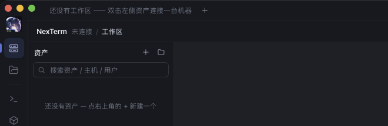
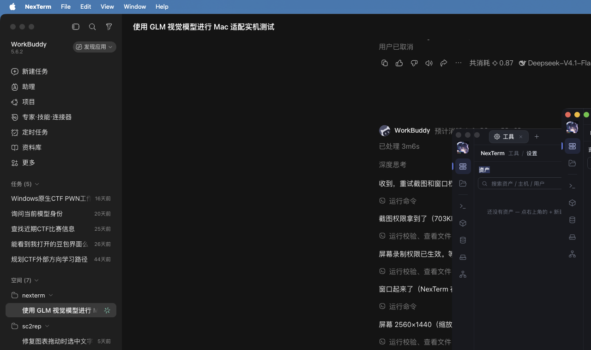
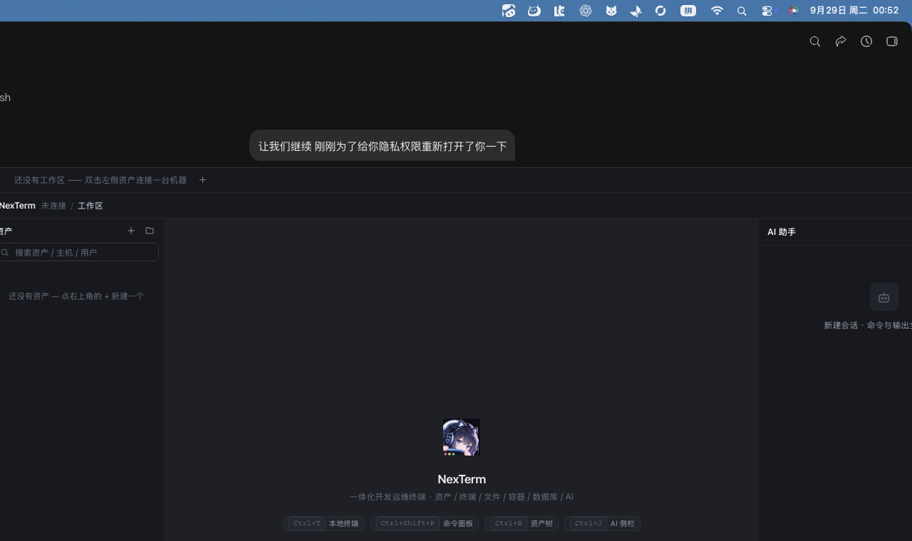

# NexTerm macOS 适配 · 实机验收记录

> 日期：2026-09-29 · 对象：`master@70324cd`（v0.1.1）+ 未提交的 mac 适配改动（16 改 + 4 新增）
> 靶机：LinuxCore `netmap.lazycore.heiyu.space`（Debian 12 / kernel 6.1.112 / x86_64 / 30G RAM / 937G 盘，用户 `linuxcore` ∈ sudo,docker）
> AI：智谱 GLM `glm-5.3-flash`（OpenAI 兼容端点 `https://open.bigmodel.cn/api/paas/v4`，BYOK）
> 本机：macOS，屏 2560×1440，Rust 1.98.1 / Node 22.22.2 / pnpm 11.24.0

## 一、质量门（全绿）

| 门 | 命令 | 结果 |
|---|---|---|
| 格式 | `cargo fmt --all --check` | ✅ |
| 静态检查 | `cargo clippy --all-targets --all-features -- -D warnings` | ✅ 0 警告 |
| 内核测试 | `cargo test --workspace` | ✅ 169 passed + local_pty 1 + ssh_e2e 1，0 failed |
| 前端类型 | `pnpm typecheck` | ✅ |
| 前端规范 | `pnpm lint`（--max-warnings 0） | ✅ |
| 前端构建 | `vite build` | ✅ 2.59s，mock 为独立 chunk |

> ⚠️ 上表 `cargo test` 里**含跳过式通过**：钥匙串用例与 `ssh_e2e` 默认门控关闭，
> 打印 `[skip]` 后 `return` —— 仍计入 `ok`。真证据见第二节（带门控重跑）。

## 二、macOS 专属能力实测

### 2.1 钥匙串 vault（mac 新增，替代 Windows DPAPI）

```bash
NEXTERM_TEST_KEYCHAIN=1 cargo test -p nexterm --lib vault:: -- --nocapture --test-threads=1
# → 20 passed; 0 failed（0.18s，真跑）
```

真跑的 4 个 mac 用例：

| 用例 | 覆盖 |
|---|---|
| `keychain_roundtrip` | `security_framework` 真写 / 真读登录钥匙串 |
| `mac_init_dpapi_works_on_first_run` | 首次初始化：DEK → 钥匙串，信封只存 `keychain:v1` 标记 |
| `mac_load_unlocks_via_keychain` | 模拟重启后凭标记无感解锁，DEK 前后一致 |
| `mac_load_survives_missing_keychain_item` | 条目丢失（≈换机）→ 降级「未初始化」，**不拦启动** |

跑完清场核验：

```bash
security find-generic-password -s com.nexterm.desktop -a vault-dek
# → SecKeychainSearchCopyNext: The specified item could not be found in the keychain.  ✅ 无残留
```

### 2.2 SSH 真机端到端（exec + PTY 双通道）

```bash
NEXTERM_SSH_E2E=1 NEXTERM_SSH_HOST=netmap.lazycore.heiyu.space \
NEXTERM_SSH_USER=linuxcore NEXTERM_SSH_KEY=~/Downloads/id_rsa \
  cargo test -p nexterm --test ssh_e2e -- --nocapture
# → screen = "Last login: Mon Sep 28 22:49:28 2026 from 192.168.1.135\nlinuxcore@linuxcore:~$ "
# → SSH E2E 通过; 1 passed; finished in 1.15s（真跑，非 0.00s 跳过）
```

断言覆盖：握手 → 主机密钥 → 密钥认证 → PTY → 泵 → vt100 读屏（无 ANSI 残留）→ 写入回显。

### 2.3 macOS 原生标题栏（目视 + 日志双证）



- 原生**红绿灯**（红/黄/绿）位于左上 ✅
- 左侧图标栏 Logo **下推 28px**（`pt-[28px]`），未被红绿灯遮挡 ✅
- 标签条首元素起于 `1216 + 48(rail) + 32(pl-[32px]) = 1296` ✅ 让位生效
- 标签条可见区域**无自绘窗口按钮**（受同一个 `isMac()` 门控，见下方说明）


窗口左右两半（三栏布局 + 欢迎页 + AI 侧栏）：




启动日志（`~/Library/Application Support/NexTerm/logs/`）：

```
INFO boot: macOS 标题栏已直接配置（AppKit：红绿灯 + 透明标题栏 + 全尺寸内容）
           before=NSWindowStyleMask(32783) after=NSWindowStyleMask(32783)
INFO boot: NexTerm 内核就绪
```

`32783 = 0x800F = Titled(1) + Closable(2) + Miniaturizable(4) + Resizable(8) + FullSizeContentView(1<<15)`。
**掩码 `before == after`** —— 见发现 #1。

### 2.4 端口转发 → 内网数据库（A10 前置条件预验证）

靶机 MySQL / Redis 只绑 `127.0.0.1`，必须走转发。应用外等价验证：

```bash
ssh -f -N -o ExitOnForwardFailure=yes -i <key> \
    -L 13306:127.0.0.1:3306 -L 16379:127.0.0.1:6379 linuxcore@netmap.lazycore.heiyu.space
```

| 服务 | 真实身份 | 探测结果 |
|---|---|---|
| MySQL | 容器 `1Panel-mysql-WbSy`（mysql:8.4.2，`caching_sha2_password`） | ✅ 握手包 `b'I\x00\x00\x00\n8.4.2\x00…caching_sha2_password'` |
| Redis | 容器 `1Panel-redis-KJix`（redis:7.4.0） | ✅ `b'-NOAUTH Authentication required.\r\n'` |
| Docker | 27.3.1，15 个在跑容器（CTF 靶场 t2–t7 + GZ::CTF + 1Panel） | ✅ A9 有真资源 |

### 2.5 GLM 与 provider 层兼容性

代码侧：`ai/provider/openai_compat.rs` 同时解析流式 `delta.reasoning_content`（L292）与
整块 `message.reasoning_content`（L370），分别投喂 `StreamItem::Reasoning` / `Delta`；
`list_models()` 打 `{base_url}/models`。实测：

| 检查 | 结果 |
|---|---|
| `GET /api/paas/v4/models` | ✅ HTTP 200，`{"object":"list","data":[…]}` |
| 流式 SSE | ✅ 先 `reasoning_content` 分片、后 `content` 分片，OpenAI 兼容 |
| 工具调用（**未发** `tool_stream`） | ✅ 仍完整返回：`finish_reason:"tool_calls"`，`arguments:"{\"command\":\"whoami\"}"` 整块 |
| 工具调用（发 `tool_stream:true`） | ✅ 变为增量分片，按 index 聚合逻辑同样兼容 |
| **不传 `max_tokens`**（与代码一致） | ✅ `finish_reason:"stop"`，正文 198 字，思考 310 tok，无空回答 |

> 首轮探活曾用 `max_tokens:32` 得到空 `content`（预算被强制思考吃光）——
> 因代码从不发 `max_tokens`，该风险在真实链路上不存在。

## 三、发现（均不阻塞，按优先级）

| # | 级别 | 问题 | 根因 / 建议 |
|---|---|---|---|
| 1 | 次要 | `lib.rs` 的 AppKit 标题栏配置，掩码 `before == after == 32783`，**是幂等空操作** | tao/wry 早已把掩码设对；真正生效的是 `setTitlebarAppearsTransparent(true)` + `setTitleVisibility(Hidden)`（未打日志）。建议日志改述为「断言式兜底」并把透明/隐藏的实际值也记下来，否则容易被读成「掩码被修正了」 |
| 2 | 主要 | `.github/workflows/ci.yml` 写 `on.push.branches: [main]`，但仓库默认分支是 **master** | **push 到 master 不触发 CI** → 双平台质量门形同虚设。改成 `master`（或 `['main','master']`）。好消息：macos 任务确实设了 `NEXTERM_TEST_KEYCHAIN: 1` |
| 3 | 次要 | `tests/ssh_e2e.rs` 未设 `NEXTERM_SSH_E2E` 时秒过（`finished in 0.00s`），CI 亦未设该变量 | 与验收文档 §7.5 记录一致，仍未收敛。建议 CI 显式区分 skipped，或至少在汇总里标注 |
| 4 | 次要 | `package.json` 的 `pnpm.onlyBuiltDependencies` 在 pnpm 11 下被忽略（每条 pnpm 命令都出 WARN） | 字段已迁移到 `pnpm-workspace.yaml`；CI 固定 pnpm 9、本地 11.24.0，口径不一致 |
| 5 | 环境 | 靶机 MySQL / Redis 由 1Panel 部署，**需要密码** | 应用内 A10（DB 面板）联测有前置条件，需先拿到凭据 |
| 6 | 环境 | 前台 dev 窗口位于 (1216,235)，右边缘 2696 > 屏宽 2560 | AI 侧栏被切 136px（窗口管理所致，非应用 bug）。手动验收前先拖到屏内 |

## 四、未验证项（需人工点击）

> **本节已在第二轮全部关闭** —— 已取得辅助功能授权，GUI 改由 AI 自动驱动并取证。
> 详见 [`ACCEPTANCE-macos-2026-09-29-gui.md`](ACCEPTANCE-macos-2026-09-29-gui.md)。
> 下表保留第一轮的原始状态与预期，便于对照。

本机终端**无辅助功能（Accessibility）权限**，`osascript` → `System Events 权限违例 (-10004)`，
无法驱动 GUI。以下需人工点击：

| 项 | 对应验收 | 预期 |
|---|---|---|
| 资产连接 LinuxCore | A6/A7 前置 | 首连弹指纹确认 → 提示符 `linuxcore@linuxcore:~$` |
| Docker 面板 | A9 | 列出 15 个容器（`t7-nacos`…`1Panel-mysql-WbSy`） |
| 新建端口转发 → DB 面板 | A10 | `L 13306→127.0.0.1:3306` 后需填 1Panel 凭据 |
| 模型配置 + 两步连通性 | A6 | base `https://open.bigmodel.cn/api/paas/v4`，模型 `glm-5.3-flash`；模型列表 ✓ + 对话 ✓ |
| AI 排障 / 接管 | A6/A7 | 上下文引用侦察快照（Debian 12 / 6.1.0-26）；接管横幅 + 立即夺回 |

## 五、复现用工具

`winlist.c` —— 无辅助功能权限时枚举窗口几何（`System Events` 的替代方案）：

```bash
clang -O2 -framework CoreGraphics -framework CoreFoundation -o /tmp/winlist winlist.c && /tmp/winlist
```

> 备注：本机 CLT 的 Swift 工具链已损坏（`redefinition of module 'SwiftBridging'`），故用 C。
